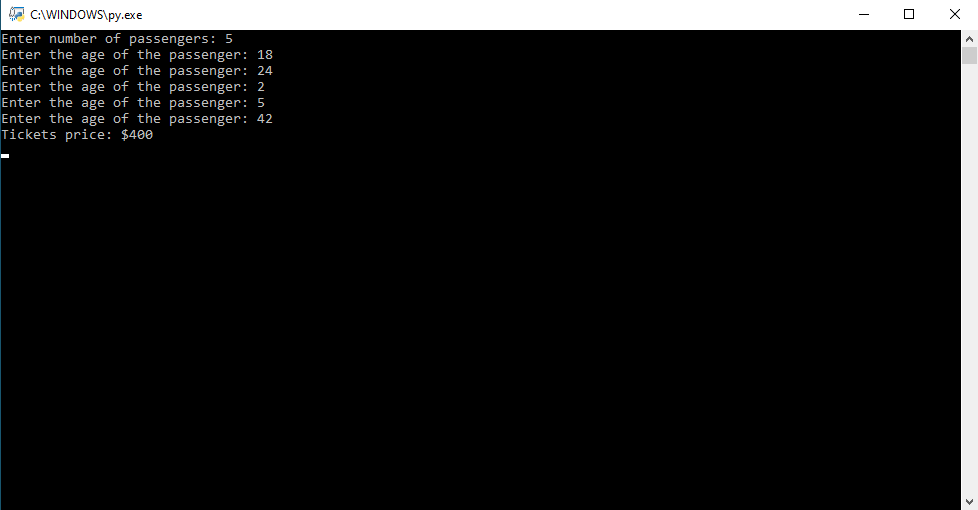

# ticket-prices
Simple ticketing system. The price of a single ticket is $100. For childern under 3 years of age, the ticket is free. The program takes the ages of passengers as input and output the total price for their tickets.

Live demo [_here_](https://replit.com/@BartlomiejLis/ticket-prices).

## Table of Contents
* [Tech Stack](#tech-stack)
* [Screenshots](#screenshots)
* [Run Locally](#run-locally)
* [Project Status](#project-status)
* [Authors](#authors)

## Tech Stack
- Python

## Screenshots


## Run Locally
Clone the project

```bash
  git clone https://github.com/bartlomiejlis/ticket-prices.git
```

Go to the project directory and run main.py with Python.

The program works in text form. Follow instructions on your screen to start using it.

## Project Status
Project is: _no longer being worked on_.

## Authors
Created by Bartłomiej Lis - feel free to contact me at lisu.b117@gmail.com!
